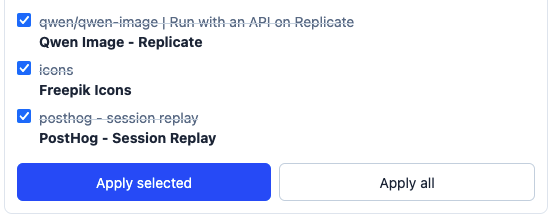
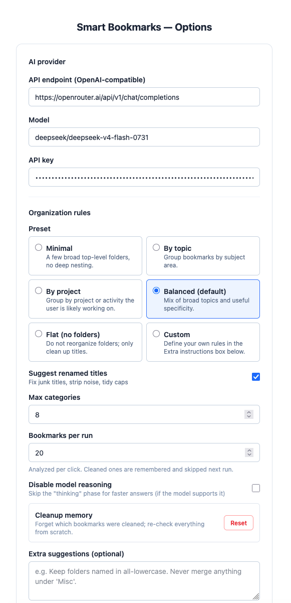

# Firefox Smart Bookmarks

A Firefox extension that reads your native browser bookmarks and uses AI to suggest how to sort and categorize them, so you can keep a nicely organized bookmark collection with minimal effort.

## How it works

1. **Read** — The extension uses the Firefox [`bookmarks`](https://developer.mozilla.org/en-US/docs/Mozilla/Add-ons/WebExtensions/API/bookmarks) API to read all of your bookmarks (title, URL, folder structure).
2. **Analyze** — It sends your bookmarks to an AI model (via [OpenRouter](https://openrouter.ai/) or another compatible provider) and asks it to:
   - Suggest a logical set of category folders (e.g. Development, News, Shopping, Recipes, Entertainment).
   - Classify each bookmark into one of those categories.
   - Optionally rename or reorder bookmarks for consistency.
3. **Apply** — You review the suggestions and, with a single click, the extension creates the proposed folder structure and moves bookmarks into it using the same native `bookmarks` API.

## Features

- Reads your bookmarks locally using the Firefox native bookmarks API — no exporting/importing required.
- Uses the powerful `bookmarks` API for browsing, creating, and moving bookmarks.
- AI-driven categorization and sorting with your choice of model/provider (OpenRouter by default).
- Manual review step: you approve a diff of proposed changes before anything is written.
- Non-destructive: it can preview changes and report a summary of what will be moved/renamed.

## Screenshots

Live progress while the AI analyzes a batch of bookmarks:

Reviewing suggested moves, grouped by target folder:

Rename suggestions (old → new):

Configuring the provider, batch size, and cleanup settings:

## Privacy

- All bookmark reading/writing happens through the Firefox native `bookmarks` API.
- The only data that leaves your machine is the bookmark list sent to the AI provider you configure (OpenRouter by default).
- You can review and reject all AI suggestions before they are applied.
- Add your model key/settings in the extension options; nothing is stored remotely.

## Prerequisites

- Firefox (the WebExtensions API version that includes the `bookmarks` API).
- An API key for your AI provider (e.g. [OpenRouter](https://openrouter.ai/)).

## Installation

### From releases (end user, no build required)

1. Download the latest `.zip` from the [Releases](https://github.com/jaroslaw-weber/firefox-smart-bookmarks/releases) page and unzip it.
2. Open Firefox → `about:debugging` → **This Firefox** → **Load Temporary Add-on**.
3. Select the `manifest.json` from the unzipped folder.
4. Open the extension options, enter your API key, and click **Analyze**.

**Note:** Temporary add-ons load fine from `about:debugging`, but are cleared when Firefox restarts. For a permanent install the add-on must be **signed** — see [Permanent install](#permanent-install).

### Permanent install

Firefox only runs signed add-ons permanently. To get a signed copy:

- Submit the add-on for [self-distribution on addons.mozilla.org](https://extensionworkshop.com/documentation/publish/submitting-an-add-on-for-self-distribution/) — AMO signs it privately, no public listing required.
- Alternatively, use a build that allows unsigned add-ons (e.g. [Developer Edition or ESR](https://extensionworkshop.com/documentation/publish/signing-and-distribution-overview/#permission-to-load-unsigned-add-ons)) and install the `.zip` directly.

### From source (development)

The UI is built with React + Tailwind via Vite, so you build first:

1. `npm install`
2. `npm run build` — bundles `src/` into `dist/` (popup, options, background, manifest, icons).
3. `npm run start` — runs `web-ext run --source-dir dist` against a temporary Firefox profile.
   (Or load `dist/` unpacked via `about:debugging` > This Firefox > Load Temporary Add-on.)
4. Open the extension popup, enter your API key in Options, and click **Analyze**.
5. Review the suggested category structure and changes.
6. Click **Apply** to reorganize your bookmarks.

`npm run dev` combines build + `web-ext run`.

## Configuration (manifest.json)

The extension uses the `bookmarks` permissions to read and modify your bookmarks. Relevant entries also include your configured AI provider endpoint and key.

## License

MIT. See [LICENSE](LICENSE).